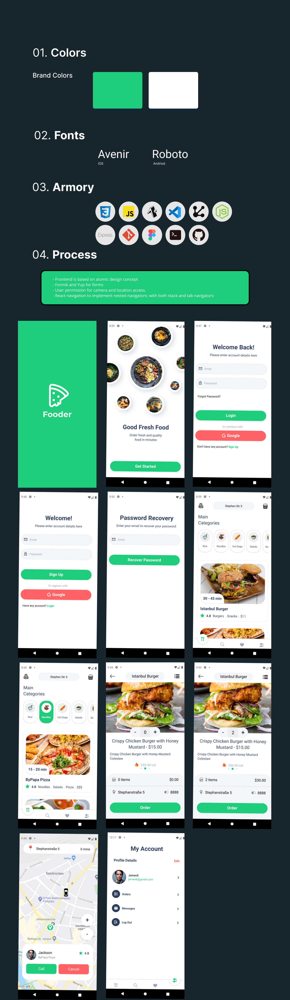

### Fooder - React Native

<br />
<p align="center">
  <a href="https://expo.io/accounts/m90khan/projects/fooder-app">
    
  </a>

  <h3 align="center">Fooder | Food Delivery app </h3>

  <p align="center">
Order food online <br />
    <a href="uxdkhan@gmail.com"><strong>Contact Me</strong></a>
    <br />
    <br />
    <a href="https://expo.io/accounts/m90khan/projects/fooder-app">View Demo</a>

   </p>
</p>

## Table of Contents

- [About the Project](#about-the-project)
- [Process](#process)
- [Skills](#skills)
- [Code Snipet](#code)
- [Connect with me](#Contact)

---

### About the Project

https://expo.io/accounts/m90khan/projects/fooder-app


#### Process

- Frontend is based on atomic design concept
- Formik and Yup for forms
- User permission for camera and location access
- React navigation to implement nested navigators: with both stack and tab navigators



---

### Skills

[][youtube]

[][youtube]
[][youtube]
[][youtube]
[][youtube]
[][youtube]
[][youtube]
[][youtube]
<br />
<br />

---

### Code Snippet

```javascript
import { useContext } from 'react';
import jwtDecode from 'jwt-decode';
import AuthContext from './context';
import authStorage from './storage';
export default useAuth = () => {
  const { user, setUser } = useContext(AuthContext);
  const logIn = (authToken) => {
    const user = jwtDecode(authToken);
    setUser(user);
    authStorage.storeToken(authToken);
  };
  const logOut = () => {
    setUser(null);
    authStorage.removeToken();
  };
  return { user, logIn, logOut };
};
```

---

### Connect with me:

[][youtube]

[][twitter]
[][linkedin]
[][instagram]
[][behance]
[][dribble]
<br />

---

[youtube]: https://www.youtube.com/channel/UC96rVfdTKsjZpREnH6CaCOw
[twitter]: https://twitter.com/uxdkhan
[linkedin]: https://www.linkedin.com/in/uxdkhan
[instagram]: https://www.instagram.com/uxdkhan/
[behance]: https://www.behance.net/Khan_Mohsin
[dribble]: https://dribbble.com/uxdkhan
